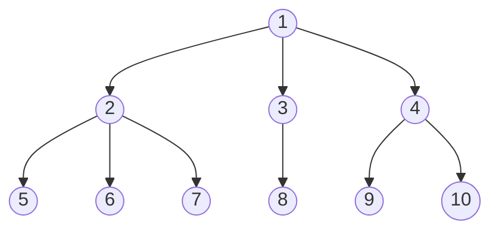

# Binary Heaps
## Definitions
There are two types of binary heaps: min-heaps and max-heaps. 

We say that a binary tree satisfies the **min-heap property** if 

- It is a complete binary tree.
- The value of a given node is smaller than the value of any other node in its subtree.

We say that a binary tree satisfies the **max-heap property** if

- It is a complete binary tree.
- The value of a given node is larger than the value of any other node in its subtree.

## Inserting Elements into Binary Heaps

<!DOCTYPE html>
<html lang="en">
   <head>
	 
    </head>
	 
<body>
 <pre><code class="language-mermaid">graph LR
A--&gt;B
</code></pre>

graph LR
A--&gt;B

	
</body>

</html>